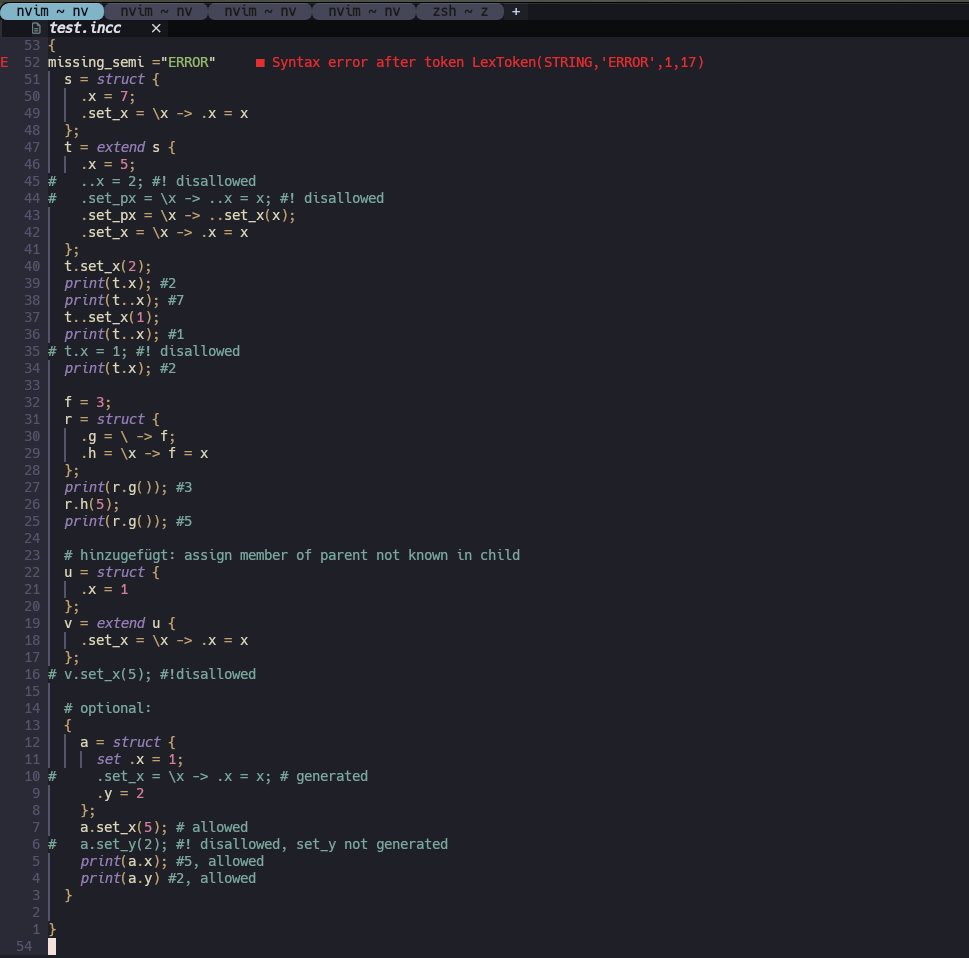

# lsp-incc.nvim


<h1 align='center'>lsp-incc</h1>

<h4 align='center'>Language Server for incc</h4>


## Introduction


## Requirements

- Neovim (>= 0.9)

### Requirements LSP
- Python (>= 3.12.0)
- numpy installed
- pipx installed
- (unix-system/scripts)
- .incc / .incc24 file
- .git as root_folder => attach to buffer only if .git exists/ 'git init' was done before

## Install

- install pipx first
- after `sh install.sh` default should work
- With [lazy.nvim](https://github.com/folke/lazy.nvim)

```lua
require("lazy").setup({
	{
		"DominikOcsofszki/lsp-incc.nvim",
		config = function()
			require("mason").setup()
			require("mason-lspconfig").setup()
			require("lsp-incc").setup()
			require("lspconfig").incc24_lsp.setup {}
			vim.cmd.colorscheme("habamax")
		end,
		dependencies =
		{ {
			"williamboman/mason.nvim",
			"williamboman/mason-lspconfig.nvim",
			"neovim/nvim-lspconfig",
		},
			{
				'hrsh7th/nvim-cmp',
				dependencies = {
					'neovim/nvim-lspconfig',
					'hrsh7th/cmp-nvim-lsp',
					'hrsh7th/cmp-path',
				},
				config = function()
					local cmp = require('cmp')
					cmp.setup({
						snippet = {
							expand = function(args)
								vim.snippet.expand(args.body) -- For native neovim snippets (Neovim v0.10+)
							end,
						},
						window = {
							completion = cmp.config.window.bordered(),
							documentation = cmp.config.window.bordered(),
						},
						sources = cmp.config.sources({
							{ name = 'nvim_lsp' },
							{ name = 'luasnip' },
						}, {
							-- { name = 'buffer' }, -- This is used to get info form file/buffer
							{ name = 'path' },
						})
					})
				end
			},
		},
		build = 'sh install.sh'
	}
})
```

### per [pipx](https://github.com/pypa/pipx):
- pipx — Install and Run Python Applications in Isolated Environments
- install pipx:
```sh
brew install pipx
sudo apt install pipx
sudo dnf install pipx
sudo pacman -S python-pipx
python3 -m pip install --user pipx
```
- install incc_lsp per pipx
```sh
sh install.sh
```


# Complete init.lua file for testing on empty nvim-install
```lua
-- init.lua

-- Ensure lazy.nvim is loaded
local lazypath = vim.fn.stdpath("data") .. "/lazy/lazy.nvim"
if not vim.loop.fs_stat(lazypath) then
	vim.fn.system({
		"git",
		"clone",
		"--filter=blob:none",
		"https://github.com/folke/lazy.nvim.git",
		"--branch=stable", -- latest stable release
		lazypath,
	})
end
vim.opt.rtp:prepend(lazypath)

-- Load lazy.nvim and setup plugins
require("lazy").setup({
	{
		"DominikOcsofszki/lsp-incc.nvim",
		config = function()
			require("mason").setup()
			require("mason-lspconfig").setup()
			require("lsp-incc").setup()
			require("lspconfig").incc24_lsp.setup {}
			vim.cmd.colorscheme("habamax")
		end,
		dependencies =
		{ {
			"williamboman/mason.nvim",
			"williamboman/mason-lspconfig.nvim",
			"neovim/nvim-lspconfig",
		},
			{
				'hrsh7th/nvim-cmp',
				dependencies = {
					'neovim/nvim-lspconfig',
					'hrsh7th/cmp-nvim-lsp',
					'hrsh7th/cmp-path',
				},
				config = function()
					local cmp = require('cmp')
					cmp.setup({
						snippet = {
							expand = function(args)
								vim.snippet.expand(args.body) -- For native neovim snippets (Neovim v0.10+)
							end,
						},
						window = {
							completion = cmp.config.window.bordered(),
							documentation = cmp.config.window.bordered(),
						},
						sources = cmp.config.sources({
							{ name = 'nvim_lsp' },
							{ name = 'luasnip' },
						}, {
							-- { name = 'buffer' }, -- This is used to get info form file/buffer
							{ name = 'path' },
						})
					})
				end
			},
		},
		build = 'sh install.sh'
	}
})
```
- example: example.incc or example.incc24
```incc
{
missing_semi ="ERROR"
  s = struct {
    .x = 7;
    .set_x = \x -> .x = x
  };
  t = extend s {
    .x = 5;
#   ..x = 2; #! disallowed
#   .set_px = \x -> ..x = x; #! disallowed
    .set_px = \x -> ..set_x(x);
    .set_x = \x -> .x = x
  };
  t.set_x(2);
  print(t.x); #2
  print(t..x); #7
  t..set_x(1);
  print(t..x); #1
# t.x = 1; #! disallowed
  print(t.x); #2

  f = 3;
  r = struct {
    .g = \ -> f;
    .h = \x -> f = x
  };
  print(r.g()); #3
  r.h(5);
  print(r.g()); #5

  # hinzugefügt: assign member of parent not known in child
  u = struct {
    .x = 1
  };
  v = extend u {
    .set_x = \x -> .x = x
  };
# v.set_x(5); #!disallowed

  # optional:
  {
    a = struct {
      set .x = 1;
#     .set_x = \x -> .x = x; # generated
      .y = 2
    };
    a.set_x(5); # allowed
#   a.set_y(2); #! disallowed, set_y not generated
    print(a.x); #5, allowed
    print(a.y) #2, allowed
  }

}

```

- Result:



